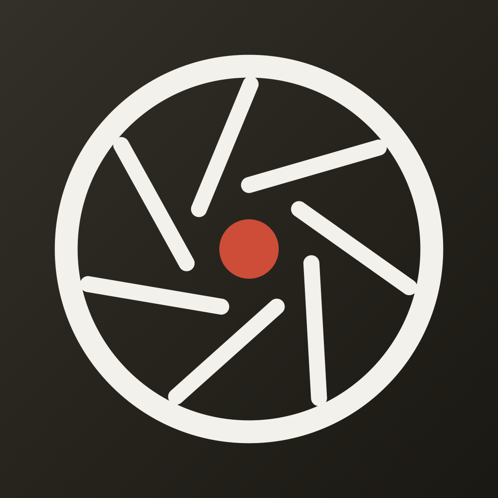

<div align="center">


# LUMA

**Posemètre iOS pour Nikon FM2.**
Il mesure la lumière avec la caméra de l'iPhone et affiche les réglages à reporter sur le boîtier.


</div>

---

## Pourquoi

J'ai un Nikon FM2 et un Nikkor 28mm f/2.8, et je débute en argentique. Un posemètre externe coûte cher et un boîtier mécanique ne pardonne pas une erreur d'exposition : sur un rouleau de 36 poses, on ne voit ses ratés qu'au développement.

Luma répond à une seule question, la seule qui compte au moment de déclencher :

> **Quelle ouverture, quelle vitesse, pour cette scène et cette pellicule ?**

Pas de journal de prises, pas de compteur de vues, pas de réglages cachés. Un écran, trois valeurs.

## Ce que fait l'app

- **Mesure en direct** la luminosité de la scène via `AVCaptureSession`, en lisant l'autoexposition de l'iPhone (ISO, temps de pose, ouverture de l'objectif, offset de cible).
- **Convertit** cette lecture en EV normalisé ISO 100, lissé sur les 10 dernières mesures pour un affichage stable.
- **Recommande** une seule configuration, choisie par une règle déterministe pensée pour le 28mm à main levée.
- **Laisse explorer** les paires équivalentes à la molette, avec retour haptique en cliquet — comme le barillet du FM2.
- **Refuse de mentir** : si la scène sort de la plage du boîtier, elle le dit au lieu d'afficher une valeur fausse.
- **Explique** en une phrase l'effet concret de l'ouverture et de la vitesse affichées.

## L'écran

Un seul écran, cinq zones de haut en bas :

| Zone | Rôle |
|---|---|
| **En-tête** | Logo LUMA + badge de la pellicule chargée. Un appui ouvre le sélecteur de film. |
| **Viseur** | Flux caméra en direct, mode de mesure (`MESURE MOYENNE` / `MESURE SPOT`) et EV courant. |
| **Molette** | Rangée horizontale des paires équivalentes, la reco encadrée de rouge au centre. Glissement + haptique. |
| **Recommandation** | Les trois valeurs en grand : ouverture, **vitesse en rouge** (clin d'œil à la gravure du boîtier), ISO du film. |
| **Pédagogie** | Deux lignes : profondeur de champ de l'ouverture affichée, risque de bougé de la vitesse affichée. |

**Mesure spot** — un toucher dans le viseur place un cercle de mesure à cet endroit ; toucher ailleurs le déplace ; toucher le cercle lui-même revient en mesure moyenne.

## Comment le calcul fonctionne

### 1. Lecture de la scène

Observation clé-valeur sur l'`AVCaptureDevice` : à chaque changement, on récupère l'`ISO` et l'`exposureDuration` choisis par l'autoexposition, la `lensAperture` (fixe, propre à l'appareil) et l'`exposureTargetOffset`.

Cet offset est ce qui sauve les scènes extrêmes : quand l'autoexposition sature, il indique de combien d'EV l'image obtenue s'écarte de la cible. Convention AVFoundation : **négatif = image plus sombre que la cible**, donc la scène est plus sombre que ce qu'ISO et durée laissent croire — d'où son addition dans la formule. Un test unitaire dédié verrouille ce signe.

### 2. EV normalisé ISO 100

```
EV100 = log₂(N² / t) − log₂(ISO / 100) + exposureTargetOffset
```

où `N` = ouverture de l'iPhone, `t` = temps de pose, `ISO` = ISO courant de l'iPhone.

### 3. Paires FM2 équivalentes

Pour la pellicule chargée : `EVfilm = EV100 + log₂(ISOfilm / 100)`.

On énumère les **7 ouvertures × 13 vitesses** = 91 combinaisons et on garde celles dont l'exposition tombe à moins de ½ EV de la cible, ordonnées de la plus ouverte à la plus fermée.

### 4. Choix de la recommandation

Priorités, dans l'ordre :

1. **Vitesse ≥ 1/125** — marge confortable contre le flou de bougé avec un 28mm à main levée.
2. **Ouverture entre f/5.6 et f/8** — zone de piqué optimal de l'objectif.
3. **Si la lumière manque** : ouvrir le diaphragme d'abord, ne descendre sous 1/125 qu'en dernier recours.
4. **Départage déterministe** si plusieurs paires restent en lice : la plus proche du cœur de la zone f/5.6–f/8 (f/6.7 en stops, de sorte que f/5.6 passe avant f/11), puis la vitesse la plus basse ≥ 1/125.

### 5. Hors plage

| Situation | Message |
|---|---|
| f/2.8 à 1s sous-expose encore de plus de ½ EV | « Trop sombre pour le FM2 à main levée » |
| f/22 à 1/4000 surexpose encore de plus de ½ EV | « Trop lumineux pour cette pellicule » |

Dans les deux cas **aucune configuration n'est affichée**. Une reco fausse serait pire que pas de reco.

## Matériel

**Nikon FM2** — vitesses mécaniques à cran entier : `1s · 1/2 · 1/4 · 1/8 · 1/15 · 1/30 · 1/60 · 1/125 · 1/250 · 1/500 · 1/1000 · 1/2000 · 1/4000` (pose B hors périmètre).

**Nikkor 28mm f/2.8** — ouvertures à cran entier : `f/2.8 · f/4 · f/5.6 · f/8 · f/11 · f/16 · f/22`.

**Pellicules** — catalogue v1 : Portra 160/400/800, Ektar 100, Gold 200, UltraMax 400, HP5+ 400, Tri-X 400, Delta 100/400, Fomapan 100/400. Plus la saisie d'un ISO manuel. Le choix est mémorisé dans `UserDefaults` : un film reste chargé pour tout le rouleau.

## Design — « Chrome & cuir »

Direction visuelle tirée du boîtier FM2 chromé : moderne léché, vintage chic.

| Rôle | Couleur |
|---|---|
| Argent champagne (fonds) | `#F5F2F0` → `#DBD9D1` |
| Noir cuir grainé | `#1F1F1C` |
| Rouge FM2 (vitesses, accents) | `#BF382B` |
| Encre / crème | `#1A1A1A` / `#F0EDE6` |

### Logo « Diaphragme »

<table>
<tr>
<td align="center" width="50%"><br /><sub><b>Encre sur champagne</b><br />in-app · <a href="docs/logo.svg">docs/logo.svg</a></sub></td>
<td align="center" width="50%"><br /><sub><b>Crème sur cuir</b><br />icône d'app · 1024 px</sub></td>
</tr>
</table>

Un iris à **7 lamelles** vu de face — 7 comme les crans d'ouverture du 28mm — avec un cœur rouge : le point de mesure.

Une seule géométrie de référence en espace 100×100 (fût = cercle r40 trait centré, lamelle = segment `(50,36)→(78.4,27.8)` répété par rotation de 360/7°, cœur r5,5), déclinée en trois rendus dont les épaisseurs de trait diffèrent volontairement pour compenser l'échelle : la vue SwiftUI vectorielle in-app ([LumaLogo.swift](Luma/Views/LumaLogo.swift)), l'icône 1024 px générée en CoreGraphics par [scripts/generate-appicon.swift](scripts/generate-appicon.swift), et le [SVG](docs/logo.svg) de ce dépôt.

**Animation de lancement** — sur fond champagne, le logo fait un tour sur lui-même en 0,9 s pendant que « LUMA » est révélé lettre par lettre depuis derrière lui, puis fondu vers l'écran principal à 1,7 s. L'écran de lancement statique système est champagne lui aussi, pour rendre la transition invisible.

## Architecture

Flux de données à sens unique : `CameraService` publie des `ExposureReading` → `ExposureCalculator` (code pur, testable) produit un `MeterResult` — soit les paires + la reco, soit un message hors plage → les vues affichent. Rien d'autre n'est persisté que la pellicule choisie.

```
Luma/
├── LumaApp.swift                    point d'entrée
├── Theme.swift                      palette Chrome & cuir, typographie
├── Services/
│   └── CameraService.swift          AVFoundation : session, lectures KVO, spot
├── Core/
│   ├── ExposureCalculator.swift     EV, paires FM2, reco  ← 100 % pur
│   ├── FM2.swift                    constantes boîtier + objectif
│   ├── FilmStock.swift              catalogue pellicules + ISO manuel
│   └── Pedagogy.swift               phrases par cran
└── Views/
    ├── MeterView.swift              écran principal, composition
    ├── ViewfinderView.swift         preview caméra + geste de mesure
    ├── DialView.swift               molette haptique des paires
    ├── RecommendationView.swift     les trois valeurs + pédagogie
    ├── FilmPickerSheet.swift        choix du film / ISO
    ├── LumaLogo.swift               logo vectoriel
    ├── LaunchSplashView.swift       RootView + animation de lancement
    └── CameraDeniedView.swift       permission refusée
```

Le projet Xcode est **généré** par [XcodeGen](https://github.com/yonaskolb/XcodeGen) depuis [project.yml](project.yml) : `Luma.xcodeproj` est jetable et gitignoré.

## Build

```bash
brew install xcodegen
xcodegen generate          # obligatoire après toute modif de project.yml
```

**Tests** (19 tests, cœur du calcul d'exposition) :

```bash
xcodebuild -project Luma.xcodeproj -scheme Luma \
  -destination 'platform=iOS Simulator,name=iPhone 17' test
```

**Installation sur l'iPhone** — app personnelle, jamais publiée sur l'App Store :

```bash
xcodebuild -project Luma.xcodeproj -scheme Luma \
  -destination 'id=<UDID>' -allowProvisioningUpdates build
xcrun devicectl device install app --device <UDID> <chemin/Luma.app>
xcrun devicectl device process launch --device <UDID> com.michaelbernard69.Luma
```

## Bon à savoir

- **Compte Apple gratuit** : la signature expire au bout de 7 jours, il faut rebuilder. Un compte développeur payant tient un an.
- **Simulateur** : pas de caméra. Les previews Xcode passent un EV fixe (`MeterView(demoEV100:)`) pour travailler l'interface sans mesure réelle — plein jour, basse lumière, hors plage. Sur simulateur, accorder la permission caméra (`xcrun simctl privacy … grant camera`) évite l'overlay « permission refusée ».
- **Fiabilité** : test de plausibilité recommandé, comparer les recos de Luma au posemètre intégré du FM2 sur quelques scènes avant de lui confier un rouleau.
- **Permission refusée** : `CameraDeniedView` explique la situation et propose un raccourci vers Réglages.

## Hors périmètre v1

Journal de prises de vue · compteur de vues du rouleau · pose B et temps de pose longs (effet de réciprocité) · support multi-objectifs — la plage f/2.8–f/22 du 28mm est isolée dans `FM2.swift` pour rester configurable plus tard.

## Documentation

- [Spécification de design](docs/superpowers/specs/2026-07-02-luma-design.md) — décisions de cadrage, calcul, identité visuelle
- [Plan d'implémentation](docs/superpowers/plans/2026-07-02-luma-v1.md) — découpage en étapes vérifiables

---

<div align="center">
<sub>Projet personnel, jamais publié sur l'App Store · non affilié à Nikon · <a href="LICENSE">MIT</a></sub>
</div>
